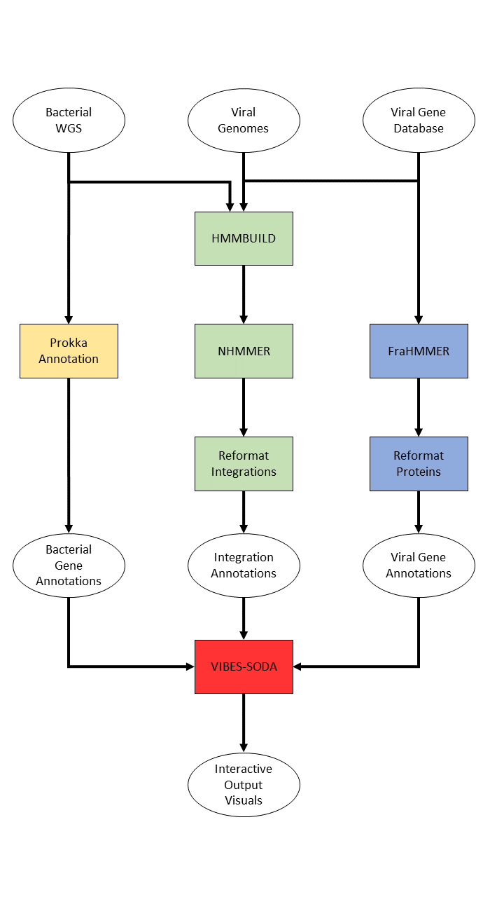

# VIBES #

## Description ##

VIBES (**V**iral **I**ntegrations in **B**acterial g**E**nome**S**) is a Nextflow-based automated sequence similarity search pipeline that can search for prophage integrations in bacterial whole genome sequence, annotate bacterial and viral proteins, and produce interactive HTML visual output. Users provide VIBES with bacterial whole genome sequence to search in and prophage genomes to search for.

## Pipeline Diagram ##

## Features ##
* Workflow automation with Nextflow
* Dependency management via VIBES docker image
* Prophage integration annotation with nhmmer
* Bacterial gene annotation with Prokka
* Viral gene annotation with FraHMMER and PHROGS
* Output visualization with VIBES-SODA

## Installation and Setup ##
### Docker/Singularity/Apptainer (Recommended) ###
1. [Install Java 11 or later](https://www.oracle.com/java/technologies/downloads/), if necessary
2. [Install Nextflow](https://www.nextflow.io/docs/latest/getstarted.html#installation), if necessary
3. Install your preferred container management software. Any one of these three should work (or you could install other software that can execute Docker images):
    * [Docker](https://www.docker.com/get-started/)
    * [Singularity](https://docs.sylabs.io/guides/3.0/user-guide/installation.html)
    * [Apptainer](https://github.com/apptainer/apptainer/blob/main/INSTALL.md)
    * Only one of the above needs to be installed to run VIBES via its Docker image
4. [Install git](https://git-scm.com/book/en/v2/Getting-Started-Installing-Git), if necessary
5. Clone the VIBES GitHub repo to your desired destination:

    `git clone https://github.com/TravisWheelerLab/VIBES.git`
6. To run VIBES, enter the `VIBES/nextflow_workflow/` directory:

    `cd VIBES/nextflow_workflow`

### Non-Container Installation ###
1. Install VIBES dependencies:
* Python 3 (v3.8.10)
* Perl (v5.30.0)
* nHMMER (v3.3) and Easel (v0.48)
* FrahMMER (v?)
* Prokka (v1.14.6)
2. [Install Java 11 or later](https://www.oracle.com/java/technologies/downloads/), if necessary
3. [Install Nextflow](https://www.nextflow.io/docs/latest/getstarted.html#installation), if necessary
4. [Install git](https://git-scm.com/book/en/v2/Getting-Started-Installing-Git), if necessary
5. Clone the VIBES GitHub repo to your desired destination:

    `git clone https://github.com/TravisWheelerLab/VIBES.git
6. To run VIBES, enter the `VIBES/nextflow_workflow/` directory:

    `cd VIBES/nextflow_workflow`

## Quick Start ##

The VIBES workflow is managed by Nextflow and run via the `nextflow run` command. To invoke VIBES with `nextflow run`, the user must supply three necessary arguments:
* A nextflow workflow file, in this case `workflow.nf` (found in `VIBES/nextflow_workflow`), that defines the VIBES workflow
* A parameters file in .YAML format, which will contain values that might change from run to run (such as input file locations, where to store output, and which parts of the pipeline should be run)
* A profile described in `nextflow.config` that specifies how Nextflow should run VIBES on your compute environment (Are you on an HPC managed by SLURM? Running VIBES locally on a laptop/desktop?)

These three components are supplied to Nextflow as follows: `nextflow run workflow.nf -params-file your_params.yaml -profile your_profile`. In general, `your_params.yaml` will be modified from run to run, `your_profile` will likely only be modified when you set VIBES up on a new compute system, and `workflow.nf` will be modified only when advanced users want to change how the VIBES workflow operates. The basics of setting up a parameters YAML file and a Nextflow profile are explored below.

### parameters.yaml ###

The parameters file contains values that might change from run to run: Where to gather input files from, where output should be stored, input sequence type (dna/rna/amino), and which parts of the pipeline should be run. An example parameters file is provided with VIBES at `VIBES/nextflow_workflow/fixture_params.yaml` and includes all fields VIBES expects parameters files to provide.

Parameters files should be in YAML format, in which a variable is followed by a colon and then a value. For example, in this line `genome_files: ${projectDir}/../fixtures/5_full_bac_2_vir/*.fna` from `fixture_params.yaml`, `genome_files` is the variable name and `${projectDir}/../fixtures/5_full_bac_2_vir/*.fna` is the value assigned to the variable. **Changing variable names will result in VIBES crashing**, so only values should be changed unless the user also modifies `workflow.nf`.

In Nextflow parameters files, some environment variables can be accessed that can make it easier to reference files outside of the directory that Nextflow is being run in. `${projectDir}`, for instance, points Nextflow to the directory that `workflow.nf` is located in (in this case, `VIBES/nextflow_workflow/`). Using these environment variables to point to file path(s) is important since Nextflow runs each portion of the workflow from subdirectories in a `work/` directory, so relative file paths will not point to the correct locations unless they inlcude `${projectDir}` or `${launchDir}`.

### Profiles and nextflow.config ###

Profiles tell Nextflow how it should try to run tasks in the workflow: should it use Docker or not? Should it submit jobs to a scheduler (i.e. SLURM) or run them itself? Essentially, profiles set default options for tasks across the VIBES workflow that hold unless specifically overwritten in a task definition. `VIBES/nextflow_workflow/nextflow.config` contains example profiles for the VIBES workflow and is where users should store their own profiles as needed.

A couple of key profile options to pay attention to: `process.executor` allows users to set whether Nextflow should submit tasks to an executor like SLURM ([list of job managers supported by Nextflow)](https://www.nextflow.io/docs/latest/executor.html)) or run the tasks locally. Similarly, `docker.enabled` and `process.container` tell Nextflow to use Docker to run containers and sets the default container for all tasks to the value of `process.container`. `process.clusterOptions` will be an important profile setting for most users who run VIBES on a HPC environment- this setting appends its value to all commands submitted to a job manager (i.e. SLURM) and is a useful place to set cluster options such as partition or an account to be billed.

Full profile documentation can be [found here.](https://www.nextflow.io/docs/latest/config.html?highlight=profile#config-profiles)

### Launching VIBES ###

Once you've created a YAML file with your preferred parameters and a profile for your environment, you can launch VIBES with `nextflow run workflow.nf -params-file your_params.yaml -profile your_profile`. If you want to resume a run of VIBES after resolving whatever issue stopped it, you can resume the previous run by adding `-resume` to your `nextflow run` command (`nextflow run workflow.nf -params-file your_params.yaml -profile your_profile -resume`).

## Detailed Usage ##
### parameters.yaml ###
Parameters files are YAML format files containing information such as the location of input bacterial genome sequence, input prophage genome sequences, and which parts of the VIBES pipeline should be run. In YAML format, a variable is followed by a colon and then a value. For example, in this line `genome_files: ${projectDir}/../fixtures/5_full_bac_2_vir/*.fna` from `fixture_params.yaml`, `genome_files` is the variable name and `${projectDir}/../fixtures/5_full_bac_2_vir/*.fna` is the value assigned to the variable. **Changing variable names will result in VIBES crashing**, so only values should be changed unless the user also modifies `workflow.nf`.

In the example parameter file `VIBES/nextflow_workflow/fixture_params.yaml`, some values are preceeded by `${projectDir}`. This is a Nextflow environment variable that tells the workflow to start from whichever directory the workflow file lives in (by default, `VIBES/nextflow_workflow/`) when following a file path. We recommend using `${projectDir}` as the root for relative paths to input and output files or directories.

A complete list of VIBES workflow parameters in the YAML file:
* Basic options:
    * genome_files: Path to input bacterial genome sequences in FASTA format. Using glob patterns (i.e. `*.fasta`) allows for multiple matching files to be selected ([more information on glob patterns](https://en.wikipedia.org/wiki/Glob_(programming)))
    * phage_file: Path to input FASTA file containing all phage genomes you want to search for.
    * phage_seq_type: dna/rna/amino, depending on phage sequence residues
    * output_path: Path to directory where VIBES will save all output data
* Workflow function options:
    * detect_integrations: Run the portion of the pipeline that searches bacterial genomes for prophage integrations
    * annotate_phage_genes: Annotate proteins on user-provided prophage genomes
    * prokka_annotation: Annotate genes on bacterial genomes with Prokka
    * zip_prokka_output: Compress output as .tar.gz files to save space
* Prophage gene annotation options:
    * viral_protein_db: Path to prophage gene database, which must be in .hmm or .frahmm format
    * viral_protein_annotation_tsv: Path to .tsv file with two fields: protein ID and function description, separated by a tab character

#### Configuration Environment Variables ####
In Nextflow parameters files, some environment variables can be accessed that can make it easier to reference files outside of the directory that Nextflow is being run in. `${projectDir}`, for instance, points Nextflow to the directory that `workflow.nf` is located in (in this case, `VIBES/nextflow_workflow/`). Using these environment variables to point to file path(s) is important since Nextflow runs each portion of the workflow from subdirectories in a `work/` directory, so relative file paths will not point to the correct locations unless they inlcude `${projectDir}` or `${launchDir}`.

### More on nextflow run ###

`nextflow run workflow.nf -params-file your_params.yaml -profile your_profile` is the minimum necessary command to launch VIBES, but there are some other useful options worth knowing about:
* `nextflow -log log_file.log run ...` will save a Nextflow log file
* `nextflow run workflow.nf -w /path/to/some/dir/ ...` allows users to specify a work directory other than `VIBES/nextflow_workflow/work/`, where Nextflow stores the workflow cache
* `nextflow run workflow.nf -with-report report_name.html ...` will generate an HTML report of pipeline resource usage after the workflow successfully completes.
* `nextflow run workflow.nf -resume ...` instructs Nextflow to pick up where the last run of the pipeline left off, where possible. Allows restarting a crashed pipeline while retaining as much work as possible from the previous run.
* For a list of all `nextflow run` options, and information on other Nextflow command line utilities, see the [Nextflow docs](https://www.nextflow.io/docs/latest/cli.html#run)

    * Link to documentation

## Further Documentation ##
* [Nextflow Documentation](https://www.nextflow.io/docs/latest/index.html)

## FAQ / Troubleshooting ##
Coming Soon

## Acknowledgements ##
* Thanks for helping make VIBES happen!
    * George Lesica
    * Jeremiah Gaiser