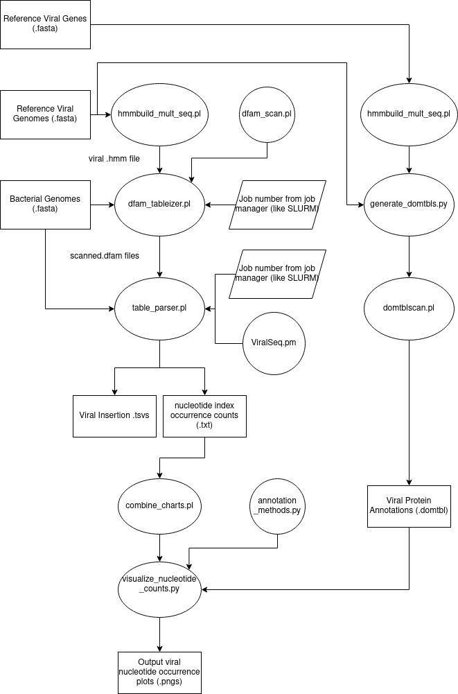

# Pseudomonas Pipeline

TODO: Describe what it is, who should care, and why those people should care (1-5 sentences)
This is a pipeline that annotates viral insertions in bacterial genomes, given a set of
reference viruses and bacterial genomes. Useful to bioinformaticians and computational biologists
because it can allow you to search for a large number of viruses in a large amount of bacterial
genomes with relatively little effort.

## Pipeline

TODO: What does the pipeline look like? Can reference scripts described later,
bonus points if you include a diagram
The pipeline is a collection of scripts written in Python and Perl. Intended to be run as follows:

## Using

TODO: Answer the following questions in this section

  1. What data are required to run it and what format should they be in?
  2. Which versions of Perl and Python are supported?
  3. What dependencies are required for each script? Maybe add alongside
     descriptions
  4. What format will the ultimate output be in?

  

  Input Data: 	- single .fasta file of reference viral genomes
  				- directory of reference bacterial genomes, one per .fasta file
  				- if annotation is desired: file of reference viral proteins, .hmm or .fasta format
  				- if annotation is desired: file of reference viral domains, .hmm or .fasta format

  Python/Perl Supported:
  				- Python 3
  				- Perl 5

  Output:
  				- .tsv (tab separated value) files for each bacterial genome describing detected
  				viral insertions
  				- .png plots showing which areas of viral genomes are most often found inserted
  				- if desired, a .pdf plot showing how integrases are distributed among bacterial
  				genomes

## Programs and Scripts

hmmbuild_mult_seq.pl
Dependencies: hmmbuild, hmmpress, Getopt::Long, strict, warnings
=====
This program accepts an input .fasta file and converts its entries into HMMs
using hmmbuild, storing them in the user-provided output .hmm file. User can
specify program verbosity, how many threads hmmbuild will use, and whether or
not hmmpress should automatically be run on output .hmm file. Users can specify
input sequence type: dna, rna, or amino acid.

dfam_tableizer.pl
Dependencies: nhmmscan, mv, dfamscan.pl, Time::HiRes, Getopt::Long, strict, warnings
=====
This program searches for viral genomes in input bacterial genomes using
nhmmscan, saving results in DFAM table format (nhmmscan's --dfamtblout option).
It then automatically runs dfamscan.pl, a program that resolves multiple matches
to the same region of bacterial DNA by keeping only the best match. Required
arguments are --hmm_db (.hmm file containing all viral genomes we want to search
for), --job_number (allows use on server clusters by specifying which bacterial
genome this instance of the program will search against), --dfam_dir (dir of
tables unmodified by dfamscan.pl), --scan_dir (dir of tables modified by
dfamscan.pl), and gen_dir (directory of bacterial genomes). User can also
specify program verbosity, the number of worker threads, and which directory to
store tables containing no matches to (unspecified leaves these tables with the
others).

run_dfam_tableizer.pl
Dependencies: seq, parallel, dfam_tableizer.pl, Time::HiRes, Getopt::Long, strict, warnings
=====
This program uses GNU Parallel to run dfam_tableizer.pl, allowing for its use
when not on a server cluster with a job manager. Use is almost identical to
dfam_tableizer.pl with one exception: rather than a --job_number option, there's
a --jobs option, which specifies the maximum number of instances of
dfam_tableizer.pl we want to run simultaneously.

table_parser.pl
Dependencies: rm, mkdir, ViralSeq.pm, FindBin::Bin, Getopt::Long, strict, warnings
=====
This program parses scanned .dfam tables, producing .tsv files and "index chart
files" where each line in the file corresponds to a nucleotide index in a viral
genome. Accepts a directory of reference viral genomes (--prophage), a dir of
.dfam tables (--dfam), a dir of bacterial genomes (--bac_genomes), an output
.tsv dir (--tsv), an output index chart dir (--index_charts), a job number
assigned by a server cluster job manager (--job_number), and a maximum
acceptable evalue (--max_eval). This program depends on ViralSeq.pm.

ViralSeq.pm
Dependencies: rm, Moose, esl-sfetch, nhmmer, strict, warnings
=====
This script describes a class using Perl's Moose module. Making a class in Perl
was a mistake. Creates a ViralSeq object containing information about a viral
sequence identified in a bacterial genome, such as its name, the bacterial
genome it was found in, and its coordinates in that genome. A fair amount of
this file's content is devoted to trying to detect flanking att sites, which
works very poorly and probably should not be used.

run_parser.pl
Dependencies: table_parser.pl, strict, warnings
=====
This script helps run table_parser.pl on a server cluster with a job manager. 

run_table_parser_parallel.pl
Dependencies: seq, parallel, table_parser.pl, Time::HiRes, Getopt::Long, strict, warnings
=====
This program runs table_parser.pl using GNU parallel, allowing for its use when
not on a server cluster with a job manager. Use is almost identical to
table_parser.pl with one exception: rather than a --job_number option, there's a
--jobs option, which specifies the maximum number of instances of
table_parser.pl we want to run simultaneously.

combine_charts.pl
Dependencies: File::Find, Getopt::Long, strict, warnings
=====
This program accepts an input index chart directory and an output chart dir. In
the input directory, each bacterial genome has its own subdirectory, which
itself contains index chart files for every virus with sequence detected in the
bacterium's genome. Each of these files has a number of lines equivalent to the
length of the virus's genome, and each line contains a number denoting how many
times sequence corresponding to that location in the viral genome has been found
in the bacterial genome. This program iterates through all of the bacterial
directories, creating an output file for each viral genome containing the found
insertion counts across all of the bacteria.

grab_viral_proteins.py
Dependencies: re, argparse, sys
=====
This program is only sort of part of the pipeline: it's designed to scan through
the headers of Uniprot protein .fasta files, looking for entries with keywords
"virus", "viral", or "phage". Produces an output .fasta file containing matching
fasta entries (both headers and sequence). This program was used to generate a
Uniprot viral protein database for viral annotation.

generate_domtbls.py
Dependencies: hmmscant, subprocess, argparse, os, re, sys
=====
This program uses hmmscant to search for viral proteins/domains contained in a
HMM database against .fasta format viral genomes, outputting results in .domtbl
format. Accepts directory of .fasta reference viral genomes, a file containing
viral sequence HMMs, an output dir, and a NCBI genetic code #.

domtblscan.pl
Dependencies: nhmmscan, trf, Getopt::Long, File::Temp, Cwd, File::Basename, strict, warnings
=====
Modified dfamscan.pl, changed to work on .domtbl format files. Adjudicates
between competing annotations at the same location in a genome

annotation_methods.py
Dependencies: re
=====
Describes Match and Genome objects, as well as a number of methods used to
annotate viral genomes with proteins and domains. The most important of these
methods is annotateGenomes, which returns a Genome object containing a
dictionary populated with Matches representing proteins/domains that matched to
the viral genome.

visualize_nucleotide_counts.py
Dependencies: matplotlib, numpy, argparse, re, os.walk, sys, json, annotation_methods.py
=====
Uses nucleotide index chart files and the annotateGenomes() method from
annotation_methods.py to draw a plot displaying the number of detected
occurences of each nucleotide in a viral genome. Below the x-axis,
differently-colored lines that correspond to a matching protein/domain are drawn
and labeled with their accession IDs. Because protein/domain matches can
overlap, lines are vertically staggered to prevent overlap. Accepts a directory
of nucleotide count charts, a directory of viral protein match .domtbl files, a
directory of domain match .domtbl files, a directory of .dfam files describing
matches to viral genes of particular interest to the virologists, and an ouput
directory where output .png plots are saved. Plots are drawn with matplotlib.

integrase_dist_plot.py
Dependencies: re, argparse, os.walk, matplotlib, annotation_methods.py
=====
Integrases seemed more likely to end up in bacterial genomes, so this program
goes counts how many integrase matches were detected per bacterial genome. It
does this by combining information about which regions of viruses are found in
bacterial genomes stored in bacterial .dfam files with information about what
proteins/domains are matched to regions of viral genomes found in viral
annotation .domtbl files. Any time a viral region corresponding to an integrase
is detected in a bacterial genome, its integrase count is iterated. This program
produces two types of output: a .csv file decribing how many integrases were
detected for every bacterial genome, and an output .pdf of a histrogram
describing the distribution of detected integrases.

## License

TODO(george): BSD 3-clause

## Authors

  - Conner Copeland
  - ...
  - Travis Wheeler
  - George Lesica

## Acknowledgements

???

